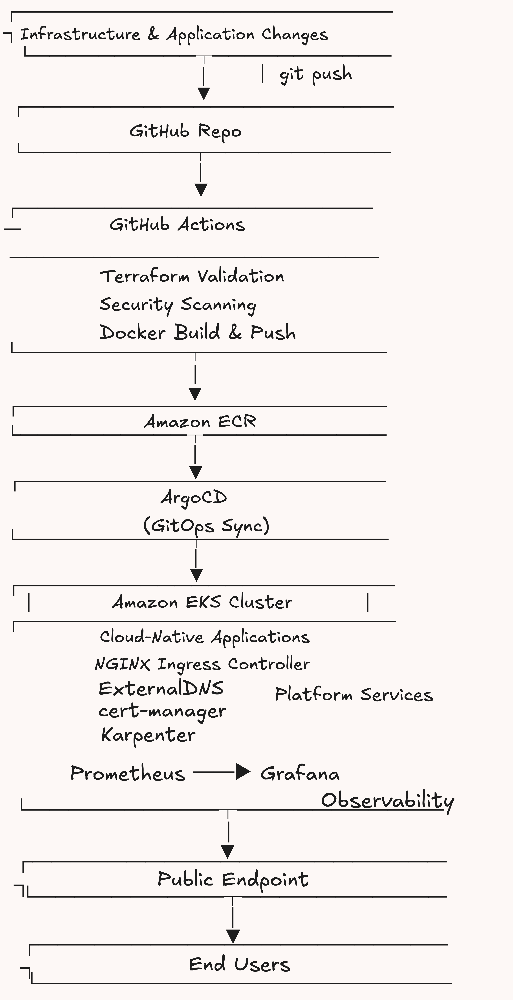
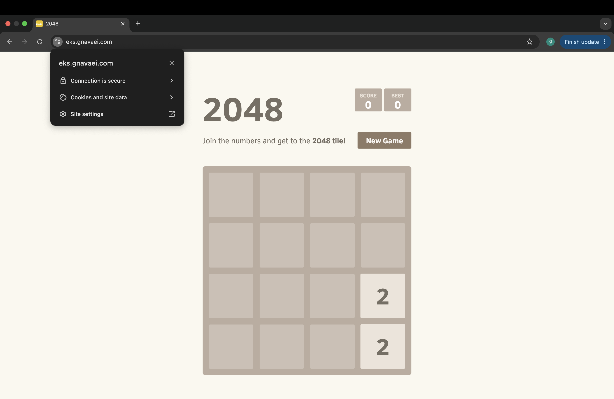
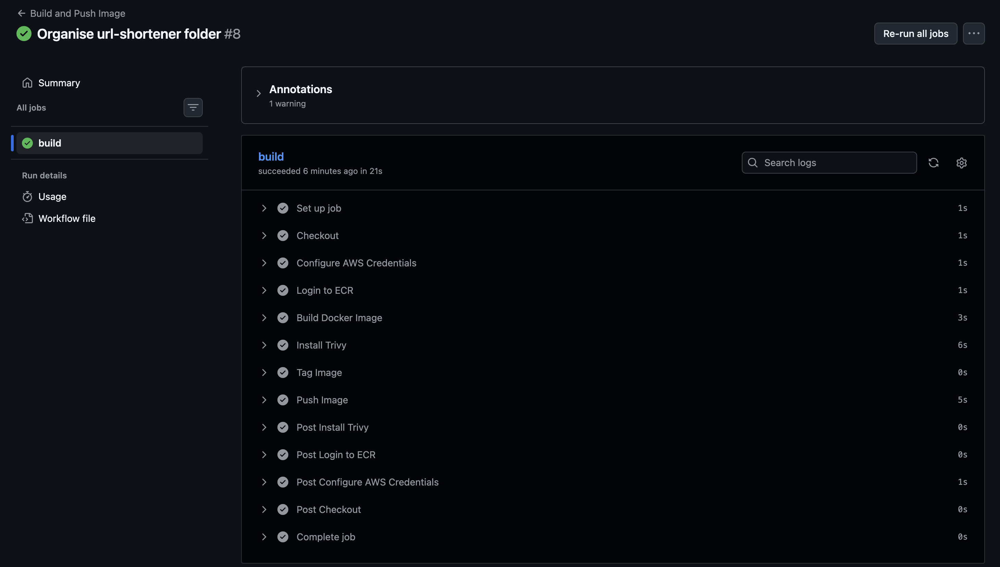
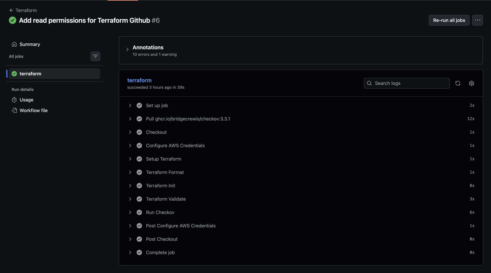
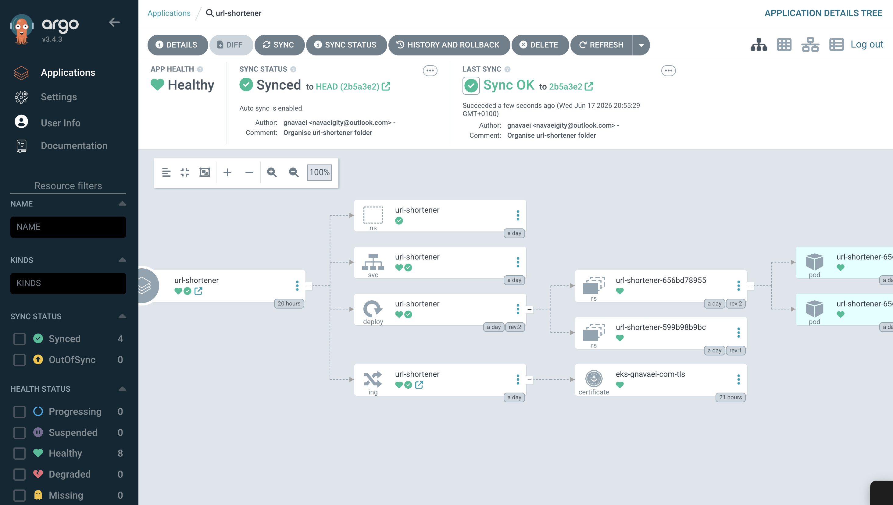
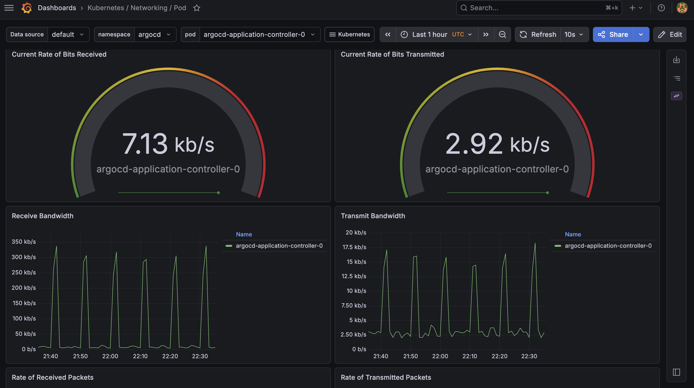
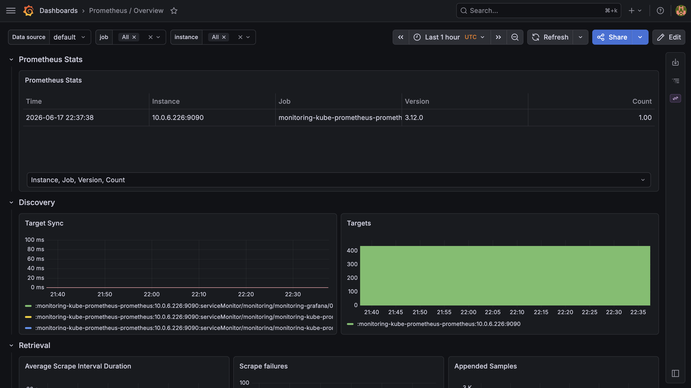

### Production-Grade Cloud Platform on Amazon EKS

## Project Overview:

End-to-end cloud-native platform built on Amazon EKS, integrating Infrastructure as Code, GitOps, CI/CD automation, security, and observability into a single deployment workflow.

The platform leverages Terraform, GitHub Actions, ArgoCD, Karpenter, ExternalDNS, cert-manager, Prometheus, and Grafana to automate the provisioning, deployment, scaling, and monitoring of containerised applications on AWS.

## Architecture Overview

  

A cloud-native platform combining Infrastructure as Code, GitOps, CI/CD, and Kubernetes automation to manage containerised applications on AWS.

## Platform Components

- Amazon EKS for container orchestration
- Terraform for Infrastructure as Code
- GitHub Actions for CI/CD automation
- ArgoCD for GitOps-based deployments
- Karpenter for dynamic node provisioning
- NGINX Ingress Controller for traffic routing
- ExternalDNS for automated Route53 record management
- cert-manager for automated TLS certificate issuance
- Prometheus and Grafana for monitoring and observability

 ## Application Deployment Workflow

 

The platform uses a GitOps workflow where infrastructure and application changes are automatically validated, deployed, and managed through code. Supporting services provide DNS automation, TLS management, autoscaling, and observability.

- The application is accessible through a custom domain secured with HTTPS:
https://eks.gnavaei.com

## Infrastructure Provisioning

The platform infrastructure was provisioned using Terraform, enabling a fully repeatable, version-controlled, and automated deployment process.

A modular Infrastructure as Code (IaC) approach was adopted to improve maintainability and separation of concerns. Individual Terraform modules were used to provision networking, Amazon EKS, Karpenter, ExternalDNS, and GitHub Actions OIDC integration, allowing infrastructure components to be managed independently while remaining reusable and scalable.

The environment was deployed within a custom Amazon Virtual Private Cloud (VPC) spanning multiple Availability Zones to provide high availability and fault tolerance. The network architecture consisted of both public and private subnets, with public subnets supporting ingress traffic and load balancers, while private subnets hosted Kubernetes worker nodes and application workloads.

Key infrastructure resources provisioned through Terraform included:

- Amazon VPC
- Public and Private Subnets
- Internet Gateway
- NAT Gateway
- Route Tables
- Amazon EKS Cluster
- Managed Node Groups
- IAM Roles and Policies
- Karpenter Node Provisioning Resources
- ExternalDNS IAM Resources
- GitHub Actions OIDC Integration

Terraform state was stored remotely in Amazon S3, providing centralised state management and enabling consistent infrastructure lifecycle operations.

## Terraform Module Structure

Infrastructure was organised into dedicated Terraform modules to separate responsibilities and simplify maintenance:

- VPC
- EKS
- Karpenter
- ExternalDNS
- GitHub Actions (OIDC)

This modular structure improved reusability and reduced complexity as the platform evolved.

## CI/CD Pipeline

Continuous Integration and Continuous Deployment (CI/CD) was implemented using GitHub Actions to automate application delivery and infrastructure validation.

The platform uses OpenID Connect (OIDC) federation to securely authenticate GitHub Actions with AWS, eliminating the need for long-lived access keys and improving overall security.

### Application Deployment Workflow
The application deployment pipeline is triggered when changes are pushed to the repository.

The workflow performs the following steps:

1. Checkout the source code
2. Authenticate to AWS using GitHub OIDC
3. Build the Docker container image
4. Perform vulnerability scanning using Trivy
5. Push the image to Amazon ECR

This automated workflow ensures that application images are consistently built, validated, and stored within a central container registry before deployment.

## Infrastructure Quality Gates

 

A separate GitHub Actions workflow was implemented to validate Infrastructure as Code changes before deployment.

The workflow performs:

1. Terraform formatting validation
2. Terraform configuration validation
3. Terraform plan generation
4. Checkov security scanning

This approach helps identify configuration errors and security misconfigurations early in the development lifecycle.

  

## GitOps Deployment

  

Application deployments were managed using ArgoCD, enabling a GitOps-based approach to Kubernetes application delivery.

ArgoCD continuously monitored the Git repository for changes and ensured that the running state of the cluster matched the desired state defined within version control. 

This provided automated deployment, drift detection, and self-healing capabilities without requiring manual intervention within the cluster.

The application manifests were stored within the repository and synchronised to Amazon EKS through ArgoCD.

When changes were committed to GitHub, ArgoCD automatically detected the updates and reconciled the cluster to the latest desired configuration.

## Security

Security was integrated throughout the platform using secure authentication, automated validation, and encrypted communication.

GitHub Actions authenticated with AWS using OpenID Connect (OIDC), eliminating the need for long-lived access keys. Security checks were incorporated into the CI/CD pipeline using Trivy for container vulnerability scanning and Checkov for Infrastructure as Code validation.

External traffic was secured using HTTPS, with Cert Manager automating TLS certificate provisioning and renewal through Let's Encrypt.

## Monitoring & Observability

  

  

Platform observability was implemented using Prometheus and Grafana, providing real-time visibility into cluster health, resource utilisation, and application performance.

Metrics were collected from Kubernetes nodes and workloads, enabling monitoring of CPU, memory, networking, and pod-level activity.

Grafana dashboards were used to visualise operational metrics and support troubleshooting, capacity planning, and platform health monitoring.

## Project Outcomes

The project successfully delivered a fully automated cloud-native platform capable of provisioning infrastructure, deploying applications, and managing operational workflows through code.

The most significant challenge was integrating multiple platform components into a cohesive and reliable environment. While each service could be deployed independently, ensuring that application delivery, networking, security, scaling, and observability worked seamlessly together required continuous troubleshooting, testing, and refinement across the platform.

The result is a scalable and repeatable environment that strengthened practical experience in Kubernetes and Platform Engineering, while providing a deeper understanding of how modern cloud-native systems operate as a complete platform rather than a collection of individual tools.

